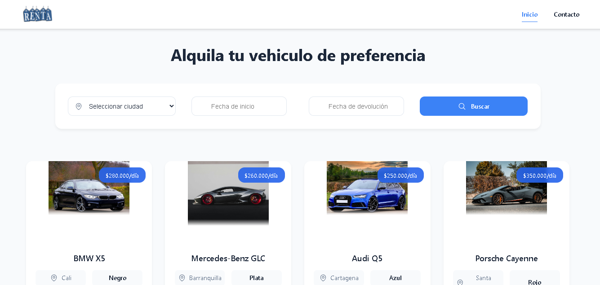
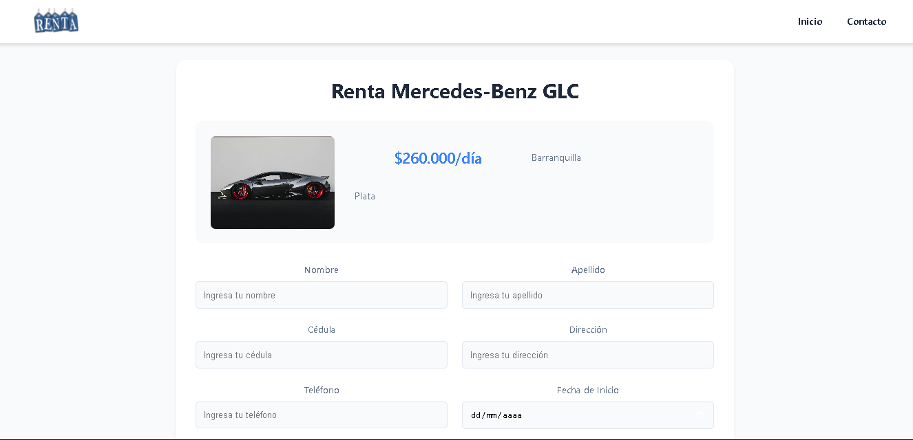
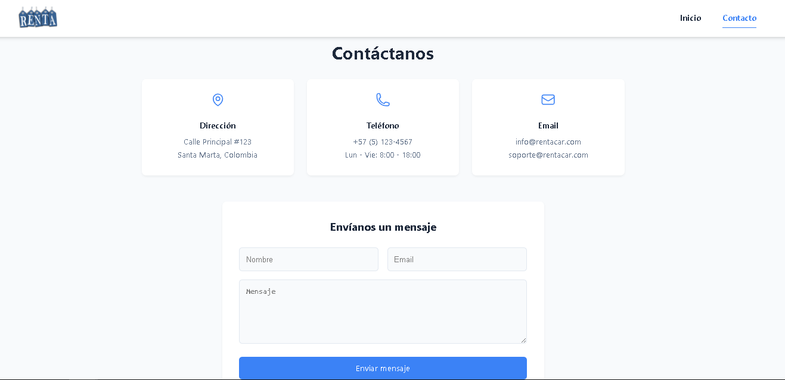

<h1 align="center">🚗 Rentcar</h1>

<p align="center">
  <strong>Plataforma moderna para la renta de vehículos, rápida, intuitiva y responsiva.</strong>
</p>

<p align="center">
  <a href="https://reactjs.org/">
    
  </a>
  <a href="https://vitejs.dev/">
    
  </a>
  <a href="https://reactrouter.com/">
    
  </a>
</p>

---

## Descripción

**Rentcar** es una plataforma web desarrollada con tecnologías modernas de frontend. Su objetivo es ofrecer a los usuarios una experiencia rápida y sencilla para **buscar, comparar y alquilar vehículos**, todo desde una interfaz limpia y responsive.

---

## Demostración visual

A continuación, se presentan imágenes en funcionamiento de la plataforma:

<p align="center">
  
</p>
<p align="center">
  
</p>
<p align="center">
  
</p>

---

## Chequealo en linea

Visita el sitio: https://rentcaronlineapp.netlify.app/

---

## Tecnologías implementadas

- ⚛️ **React 18** – Biblioteca para construir interfaces interactivas.
- ⚡ **Vite** – Herramienta de desarrollo rápida y eficiente.
- 🔀 **React Router 6** – Enrutamiento dinámico para apps SPA.
- 📅 **React DatePicker** – Selector de fechas intuitivo.
- 🎨 **CSS Modules** – Estilos encapsulados y reutilizables.

---

## Instalación paso a paso

1. **Clonar el repositorio**

```bash
git clone https://github.com/carrent/frontend.git
cd frontend
```

2. **Instalar dependencias**

```bash
npm install
```

4. **Iniciar el servidor de desarrollo**

```bash
npm run dev
```

## Uso

1. **Página de inicio**: Muestra destacados y opciones rápidas de búsqueda
2. **Búsqueda**: Permite filtrar vehículos por ubicación, fechas y tipo
3. **Detalles del vehículo**: Información completa, características y disponibilidad
4. **Formulario de renta**: Captura de datos del cliente y opciones adicionales
5. **Confirmación**: Resumen de la reserva y detalles del pago

## Equipo de desarrollo RentCar

<table>
  <tr>
    <td align="center">
      <a href="https://github.com/CALR0">
        
        <br />
        <sub><b>Carlos Lizarazo</b></sub>
      </a>
    </td>
    <td align="center">
      <a href="https://github.com/Viraviutt">
        
        <br />
        <sub><b>Victor Villarreal</b></sub>
      </a>
    </td>
  </tr>
</table>
